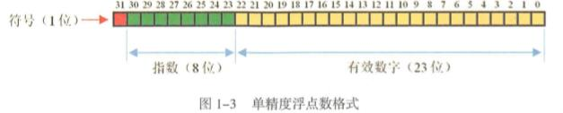
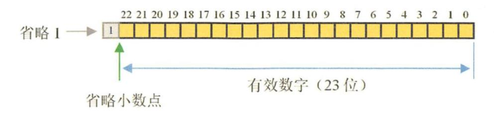

# 1 计算机基础

## 1.1 走进0与1的世界

`>>>` 无符号右移

**为什么负数不断地无符号向右移动的最小值是1 呢？**

实际编程过程中， 位移运算仅作用于 32 位和长整型（64）位。假如在整型数上，移动的位数是一个 `mod 32`的结果。即 `35>>1`与`35>>33`是一样的结果。

```java
    public static void main(String[] args) {
        int a = -1;
        System.out.println(a>>>33); // 2147483647
        System.out.println(a>>>1);  // 2147483647
        System.out.println(a>>>31>>>2); // 0
    }
```

## 1.2 浮点数

>```java
>    public static void main(String[] args) {
>        float a = 1f;
>        float b = 0.9f;
>        System.out.println(a-b); //0.100000024
>    }
>```
>
>为什么计算结果与 预期存在明显的误差?

### 1.2.1 科学计数法

科学计数法 可以来 表示一个极大或极小且位数较多的数。如 `a*10^n`，其中 `1<=|a|<10` 。

科学计数法可以唯一地表示任何一个数，且所占用的存储空间更少，计算机就是利用这一特性表示极大或极小的数值。

<div align="center">  </div><br>

### 1.2.2 浮点数表示

浮点数表示就是如何用二进制表示`符号`、`指数`和`有效数字`。

<div align="center">  </div><br>

- 阶码（指数）

存放的是指数位相对的移码，即  8 位的实际数值 为 [-128,127],对应的移码为 [0,,255]，即将真值加 128 得到。

由于 0 表示0，所以 去除 0 位，即 将真值加 127。

移码的好处是 比较两个真值的大小非常简单。

-  尾数（有效数字）

最右侧分配连续的23位用来存储有效数字，尾数用原码表示。尾数最大值为 二进制的 `1.1111..111 `，是一个无限接近于 2 的数字。

科学技术中 `1<=|a|<10` ，所以 

<div align="center">  </div><br>

**由于 计算机是这样存储浮点数的，所以 有效数字 有时只能近似表示。**

即 `16.35`尾数部分的有效数字为 l.00000101100110011001101 ＇将其转换成十进制值为 1.021875 ， 然后乘以 24 得到 16.35000038。由此可见，计算机实际存储的值可能与 真值是不一样的。


`java` 中浮点数 默认使用双精度。比单精度误差小。

### 1.2.3 浮点数的使用

对于浮点数精度要求高的场景，可以用数组保存小数部分的数据。

在比较浮点数的时候，由于存在误差，往往会出现意料 之外的结果，所以禁止通过判断两个浮点数是否相等来控制某些业务流程。

## 1.3 字符集与乱码

> **一个字节为什么是 `8 bit` ？**
>
> 因为 最开始 用计算机 表示 64 种以上符号，需要 7 位表示。加上一位的奇校验位。